# Team 3 Project Analysis: Traffic Accidents

## Content:
### 1. Data Set Analysis And Clean-up
### 2. Accidents by States 
### 3. Accidents by TX Counties
### 4. Weather Conditions effect accidents 
### 5. Road Amenity effect
### 6. Daytime effect
### 7. Payday effect 
### 8. Holidays effect 
________________________

# 1. Data Set Analysis And Clean Up 

## 1.1 Original Data Set 

## US Traffic Accidents
https://www.kaggle.com/sobhanmoosavi/us-accidents?select=US_Accidents_June20.csv

 Countrywide car accident dataset, which covers 49 states of the USA. The accident data are collected from February 2016 to June 2020, using two APIs that provide streaming traffic incident (or event) data. These APIs broadcast traffic data captured by a variety of entities, such as the US and state departments of transportation, law enforcement agencies, traffic cameras, and traffic sensors within the road-networks.

### 2016 and 2020 is not full so dataset was filtered for 2017,2018,2019

## US Cities population 
https://www.census.gov/data/tables/time-series/demo/popest/2010s-total-cities-and-towns.html

___________________
## 1.2 Data Overview : Null Values
_________________________
Data field| Count
---|---
ID |                      2563837
Source|                   2563837
TMC|                      1965015
Severity|                 2563837
Start_Time |              2563837
End_Time |                2563837
Start_Lat  |              2563837
Start_Lng   |             2563837
End_Lat      |             598822
End_Lng     |              598822
Distance(mi)  |           2563837
Description  |            2563836
Number      |              928610
Street     |              2563837
Side       |              2563837
City       |              2563781
County     |              2563837
State      |              2563837
Zipcode    |              2563073
Country    |              2563837
Timezone   |              2560804
Airport_Code  |           2558452
Weather_Timestamp |       2530471
Temperature(F)  |         2514321
Wind_Chill(F) |           1080688
Humidity(%)   |           2511771
Pressure(in)  |           2520881
Visibility(mi)  |         2507022
Wind_Direction   |        2522105
Wind_Speed(mph) |         2200487
Precipitation(in)  |       938871
Weather_Condition |       2506557
Amenity       |           2563837
Bump     |                2563837
Crossing   |              2563837
Give_Way    |             2563837
Junction  |               2563837
No_Exit      |            2563837
Railway      |            2563837
Roundabout   |            2563837
Station      |            2563837
Stop       |              2563837
Traffic_Calming  |        2563837
Traffic_Signal  |         2563837
Turning_Loop   |          2563837
Sunrise_Sunset  |         2563778
Civil_Twilight  |         2563778
Nautical_Twilight  |      2563778
Astronomical_Twilight  |  2563778
Year                |     2563837
______________________
### Observations:
Good qaulity data set - minimal null values , for our area of analysis data set is quite full :
________________________
Data field| Count
---|---
ID |                      2563837
Source|                   2563837
Severity|                 2563837
Start_Time |              2563837
End_Time |                2563837
Start_Lat  |              2563837
Start_Lng   |             2563837
Description  |            2563836
Street     |              2563837
Side       |              2563837
City       |              2563781
County     |              2563837
State      |              2563837
Zipcode    |              2563073
Country    |              2563837
Temperature(F)  |         2514321
Wind_Chill(F) |           1080688
Humidity(%)   |           2511771
Pressure(in)  |           2520881
Visibility(mi)  |         2507022
Wind_Speed(mph) |         2200487
Precipitation(in)  |       938871
Weather_Condition |       2506557
Amenity       |           2563837
Astronomical_Twilight  |  2563778
Year                |     2563837
___________________

## 1.3 Data Source 

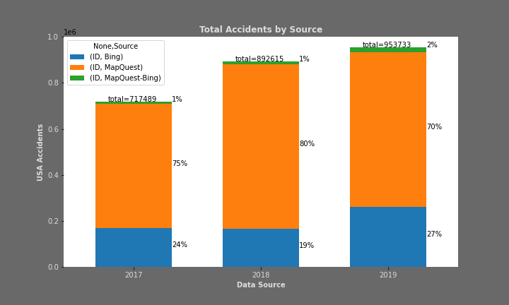
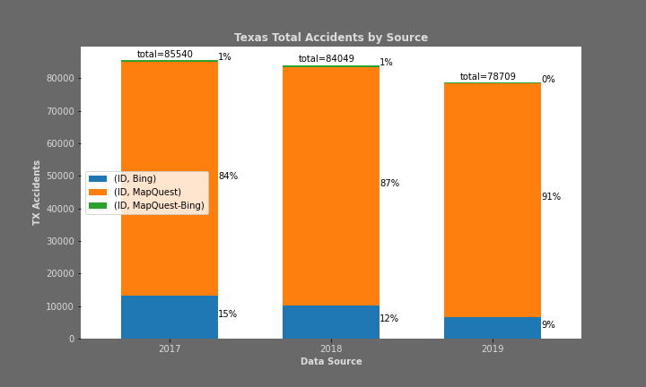

### Observations:

75% of Data is coming from MapQuest Traffic API , 24% from Bing Maps Traffic API and 1% hybrid

**_LINK TO CODE - [YK_US_Data_traffic_analysis.ipynb](../CODE_data_cleanup/YK_US_Data_traffic_analysis.ipynb)_**

**_LINK TO CODE - [YK_TX_Data_traffic_analysis.ipynb](../CODE_data_cleanup/YK_TX_Data_traffic_analysis.ipynb)_**

## 1.4 Data Overview by State
#### Data distribution by State and by year
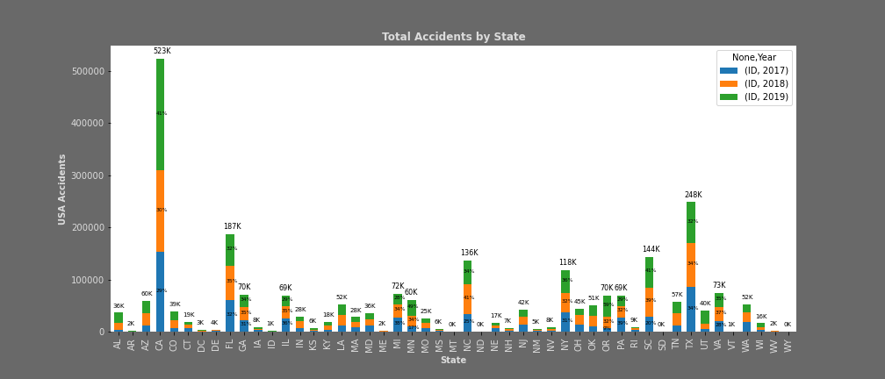

### Observations:

**_LINK TO CODE - [YK_US_Data_traffic_analysis.ipynb](../CODE_data_cleanup/YK_US_Data_traffic_analysis.ipynb)_**

_______________________

## 1.5 US States census data 2019 
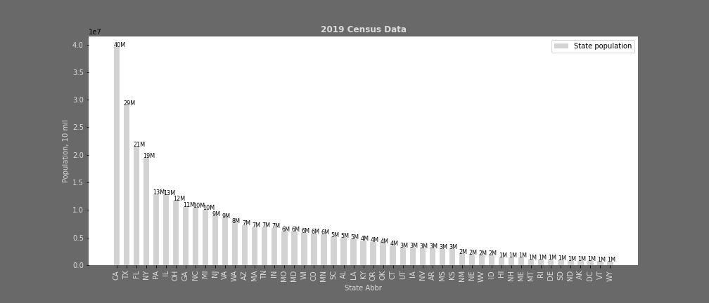

### Observations:

**_LINK TO CODE - [YK_clean_census_data_USstate_TXcounty.ipynb](../CODE_data_cleanup/YK_clean_census_data_USstate_TXcounty.ipynb)_**

______________________

## 1.6 Accidents by month-year 
#### US Accidents Bar Chart
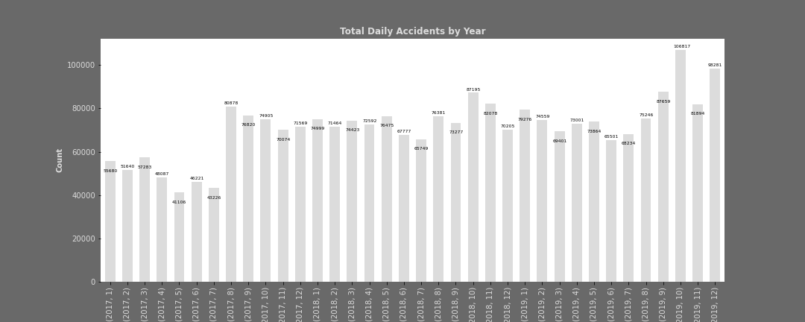

#### TX Accidents Bar Chart

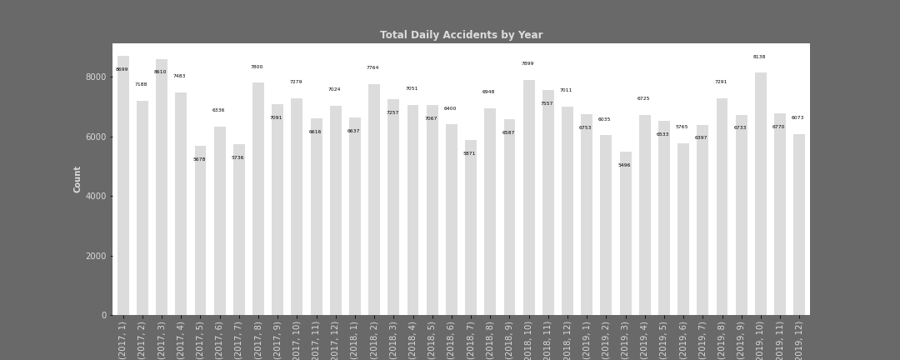

### Observations:
You can observe jump in accidents count on US bar chart  from Jul 2017 to Aug 2018 , in H1 2017 data was averaging around 45K and rest of the data is averaging around 70+K. We attribute this to qaulity of data set, and if season related analysis needs to be done data for 2017 have to be excluded. 
Texas sample for 2017 does not contain any significant variations - so for TX all  3 years can be used

**_LINK TO CODE - [YK_US_Data_traffic_analysis.ipynb](../CODE_data_cleanup/YK_US_Data_traffic_analysis.ipynb)_**

**_LINK TO CODE - [YK_TX_Data_traffic_analysis.ipynb](../CODE_data_cleanup/YK_TX_Data_traffic_analysis.ipynb)_**
_____________________

# 2 Accidents by States Analysis

## 2.1 Accidents by States
#### GMAP US States Accidents Rates per 1000 People , color scale from low - light yellow to high - purple. 

### Observations:
South Carolina stands out with higher rate.
#### Scatter plot  US States Accidents  

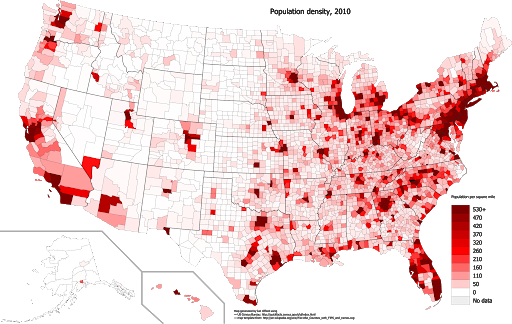

### Observations:
In general – densely populated areas - California, Florida, East and North East States are corresponded to higher traffic accidents frequency.

**_LINK TO CODE - [YK_chart_State_AAR.ipynb](../CODE_analysis/YK_chart_State_AAR.ipynb)_**

**_LINK TO CODE - [YK_accident_scatter_plot.ipynb](../CODE_analysis/YK_accident_scatter_plot.ipynb)_**

**_LINK TO CODE - [YK_State_AAR.ipynb](../CODE_analysis/YK_State_AAR.ipynb)_**

____________________

## 2.2 Top 10 States by Total Yearly accidents and top accident rate per 1000 people (averaged over 3 years)

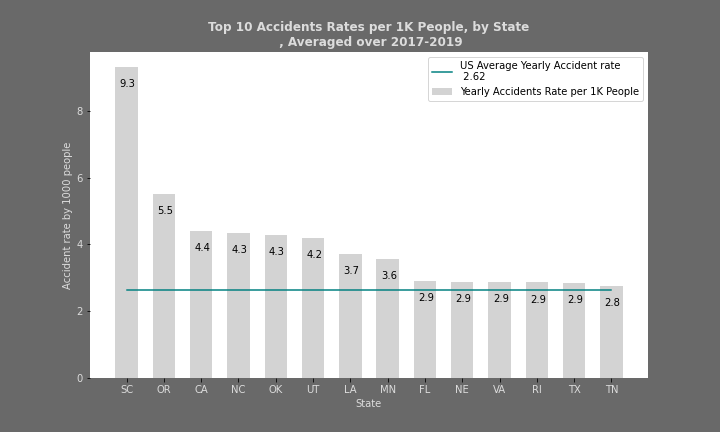

### Observations:
Accordingly to TX DOT , 562K crashes were reported in 2019. Our data set has 82K , which is a good size sample.

**_LINK TO CODE - [YK_States_TXCounties_barcharts.ipynb](../CODE_analysis/YK_States_TXCounties_barcharts.ipynb)_**

**_LINK TO CODE - [YK_State_AAR.ipynb](../CODE_analysis/YK_State_AAR.ipynb)_**

_______________

# 3 Accidents by TX County Analysis
## 3.1 Accidents by States
#### GMAP TX Counties Accidents Rates per 1000 People , color scale from low - light yellow to high - purple. 
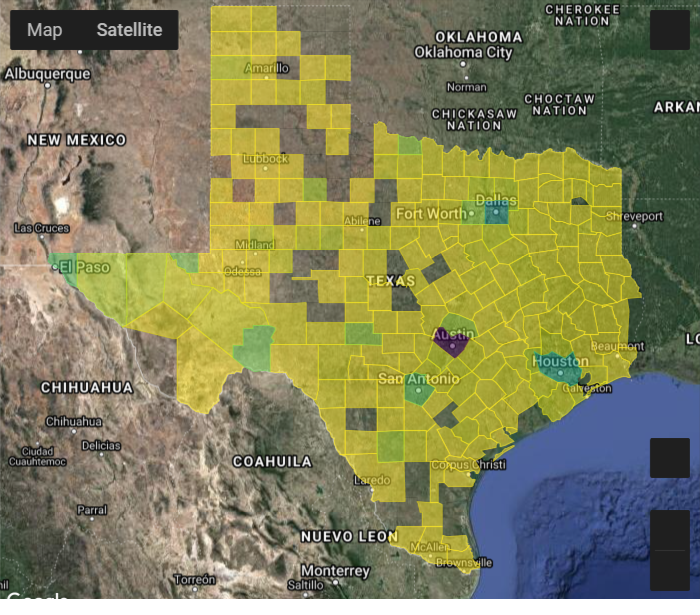

### Observations:
Travis county with Austin stands out with a higher rate.
#### Scatter plot  US States Accidents  

### Observations:
In general – densely populated areas - Harris(Houston), Dallas, Travis (Ausitn), Bexar(San Antonio) megapoloices  are corresponded to higher traffic accidents frequency.
___________________
County|	Yearly Accident rate | Population
---|---|---
Harris|	27582.0|4,646,630
Dallas|	18139.3|2,606,868
Travis|	17343.3|1,226,805
Bexar	|6449.0|1,952,843
Tarrant	|4370.7|2,049,770
El Paso	|3162.3|836,062
_____________	

**_LINK TO CODE - [YK_chart_County_AAR.ipynb](../CODE_analysis/YK_chart_County_AAR.ipynb)_**

**_LINK TO CODE - [YK_accident_scatter_plot_TX.ipynb](../CODE_analysis/YK_accident_scatter_plot_TX.ipynb)_**

**_LINK TO CODE - [YK_TXcounty_AAR.ipynb](../CODE_analysis/YK_TXcounty_AAR.ipynb)_**

____________________

## 3.2 TX Counties : Top 10 accident rate per 1000 people (averaged over 3 years)

### Observations:
Travis county stands out .

**_LINK TO CODE - [YK_States_TXCounties_barcharts.ipynb](../CODE_analysis/YK_States_TXCounties_barcharts.ipynb)_**

**_LINK TO CODE - [YK_TXcounty_AAR.ipynb](../CODE_analysis/YK_TXcounty_AAR.ipynb)_**

_______________
# 4 Texas Weather and Traffic Effects

From 2017 to 2019, there were 248,299 traffic incidents on Texas roads. What role did weather play in those incidents?
_________________
## 4.1 Seasons effect
Do the 4 seasons matter in Texas in relation to accidents/incidents?
### Observations:
There is no significant difference in the number of incidents in Texas between each of the seasons. Fall is slightly higher than the rest of the seasons.

### Observations:
Fall is slightly elevated with 64,670 incidents, Winter has 63,184, Spring has 61,900 and Summer has the least with 58,544.
___________________

## 4.2 Weather Conditions
In what type of weather conditions do we find the most incidents in Texas?

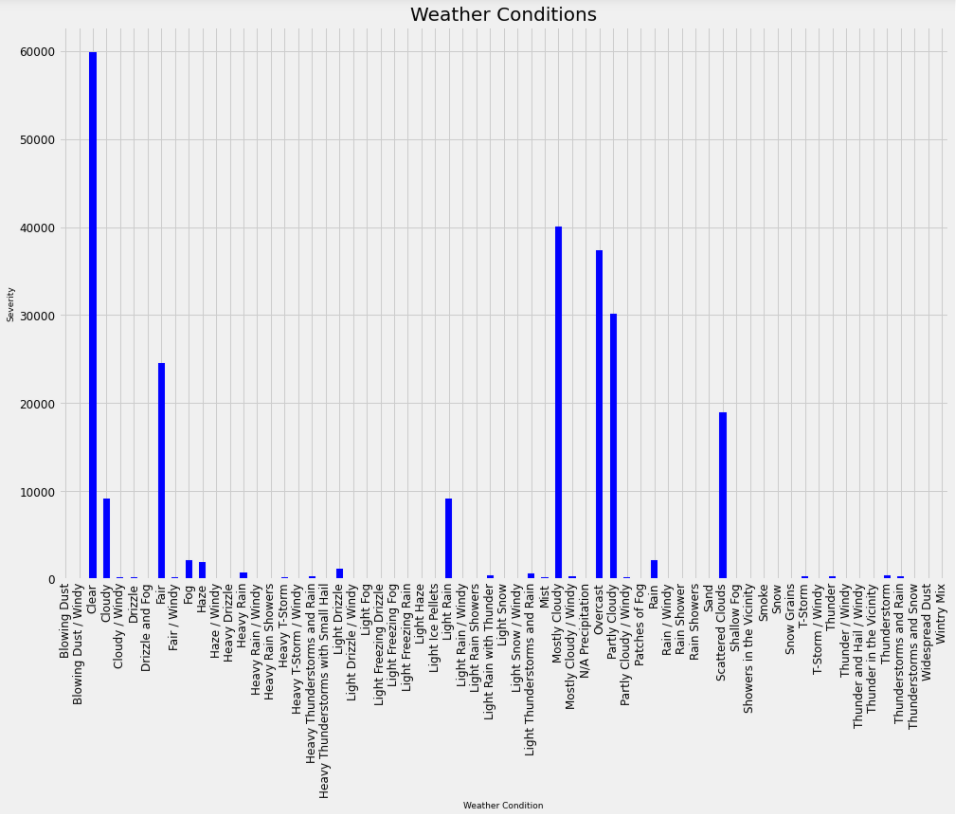

### Observations:
Strangely enough, when it comes to Texas Highways, Clear weather has the most incidents with around 60,000 during the 3 year period.   This 20,000 more
than the next highest cause - Mostly Cloudy.   Cloudiness seems to be a slight factor in the majority of all other incidents.  Any type of cloudiness, seems to 
affect the overall ability to drive in Texas.  It was expected that a heavy rain would be more of a cause of concern but that was not the case.  Light rain caused
more of an issue than the heavier rain.   Ice/Snow were really not a factor due to limited occurrences in the State of Texas. 
_____________________
## 4.3 Time of the day effect
In the top 10 weather conditions, is time of day a factor?

### Observations:
As we can see from the chart, more accidents happen during the day than they do at night.  Overcast skies had a larger role at night than all other weather conditions
with the exception of clear. 
___________________________
## 4.4 Accident Severity vs Weather effects
What type of delays are caused by these incidents?

### Observations:
Severity shows the severity of the accident in terms of traffic impact. One being the least, four being the most. In the top 10 weather conditions, the majority of the accidents fall into the 2 and 3 severity levels. For the most part, they fall into category 2 meaning that there is a slight delay when an accident occurs.
_____________________
##  4.5 Visibility effect
Does visibility play a factor in traffic incidents in Texas?

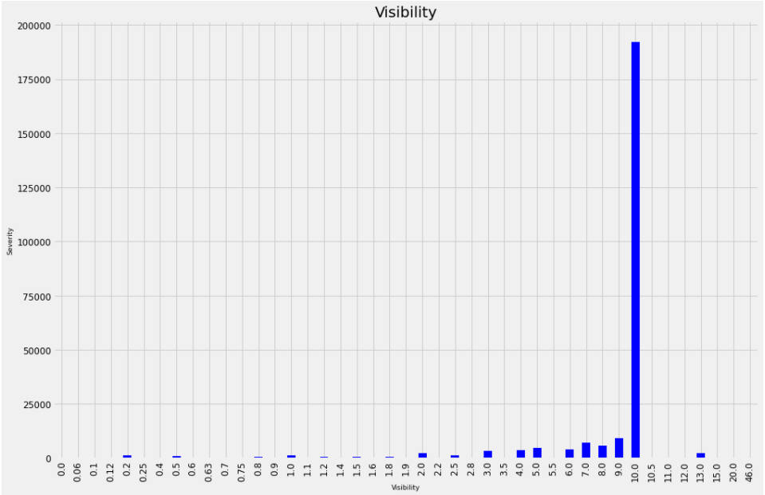

### Observations:
No, there was no correlation that limited visibility caused any additional effects on whether an incident occurred or not.  The majority of the incidents reported had a 10 mile
visibility supporting this conclusion.  While this data covered traffic delays it did not dive into the true causes of these incidents, one site on the internet gave the top 5 reasons
for accidents in Texas were failure to control speed, driver inattention, failure to drive in a single lane, failure to yield when turning left and usafe lane changes.  Tailgatomg was a close sixth cause.  

**_LINK TO CODE - [pb_WeatherEffects-Final.ipynb](../CODE_data_cleanup/pb_WeatherEffects-Final.ipynb)_**
___________________
# 5. Road Amenity effect
 
**Evaluating Car Accidents in Texas by Traffic Safety Amenities and Time of Day**

## 5.1 Traffic Safety Amenities
### Observations:
Of the auto accidents recorded in Texas from years 2017-2019, only about half recorded traffic safety amenities involved in the accidents. The overwhelming plurality of these accidents involved traffic_signals. Second and thrid runners-up are awarded to Junctions and Crossings.

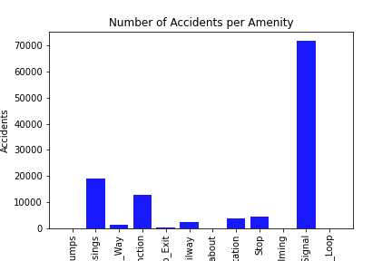

### Observations:
Based on this evidence, we assume intersections for automobils and pedestrians alike are the settings for higher accident rates.
_______________________________
# 6. Time of Day Effect

More accidents happen during the daytime vs. the nightime by about 4/1. 

Given this distribution, we broke the date down a little more:

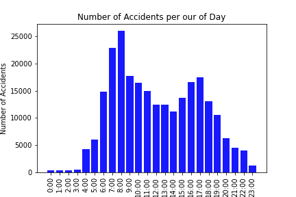

### Observations:
Obviously, there is a greater distribution of accidents by daytime hours than night time. Even further, there seem to be spikes in accident traffic during the hours of 6:00am to around 11:00am and then again from 4:00pm to 7:00pm: representing some really-bad-mronings and evenings for rush hour commuters.

**_LINK TO CODE - [cars_vs_ammenities_texas](../amenities-and-time-of-day/cars_vs_ammenities_texas.ipynb)_**