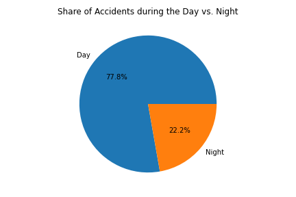

# **Evaluating Car Accidents in Texas by Traffic Safety Amenities and Time of Day**

## Files/Results
[my_notebook](../amenities-and-time-of-day/cars_vs_ammenities_texas.ipynb)

### _Traffic Safety Amenities_

Of the auto accidents recorded in Texas from years 2017-2019, only about half recorded traffic safety amenities involved in the accidents. The overwhelming plurality of these accidents involved traffic_signals. Second and thrid runners-up are awarded to Junctions and Crossings.

Based on this evidence, we assume intersections for automobils and pedestrians alike are the settings for higher accident rates.

### _Time of Day_

More accidents happen during the daytime vs. the nightime by about 4/1. 

Given this distribution, we broke the date down a little more:

Obviously, there is a greater distribution of accidents by daytime hours than night time. Even further, there seem to be spikes in accident traffic during the hours of 6:00am to around 11:00am and then again from 4:00pm to 7:00pm: representing some really-bad-mronings and evenings for rush hour commuters.
